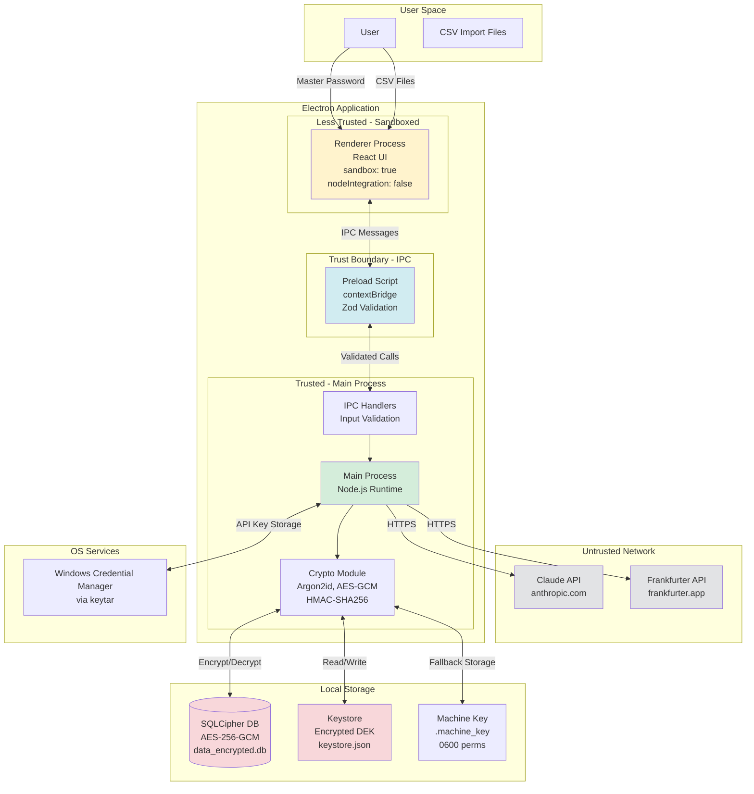

# Threat Model — Budget Desktop Application

**Version:** 2.0.0  
**Date:** 2026-06-21  
**Methodology:** STRIDE (Spoofing, Tampering, Repudiation, Information Disclosure, Denial of Service, Elevation of Privilege)

## 1. System Overview & Data Flow

### Architecture

Budget is an Electron-based desktop application for Windows that manages personal financial data locally. The application uses a zero-knowledge encryption model with SQLCipher for data-at-rest protection.

### Data Flow Diagram

### Trust Boundaries

1. **Renderer ↔ Main Process**: Renderer is sandboxed and untrusted. All communication via IPC must be validated.
2. **Main Process ↔ External APIs**: Network requests to Claude and Frankfurter are over HTTPS but responses are untrusted.
3. **Application ↔ File System**: Database and keystore files are protected by OS permissions but vulnerable to privileged local access.
4. **Application ↔ OS Services**: Windows Credential Manager (keytar) is trusted for API key storage.

## 2. Assets to Protect

### Critical Assets

1. **Financial Transaction Data**
   - Transaction records (amounts, dates, descriptions, categories)
   - Account balances and net worth snapshots
   - Budget allocations and spending patterns
   - Investment holdings and portfolio values

2. **Cryptographic Material**
   - Master password (never stored, exists only in user's memory)
   - Key Encryption Key (KEK) — derived from master password, transient in memory
   - Data Encryption Key (DEK) — encrypted at rest in keystore.json
   - HMAC signing keys — derived from master signing key
   - Argon2 salt — stored in keystore.json

3. **API Credentials**
   - Claude API key (stored in Windows Credential Manager or encrypted fallback)
   - Session tokens (if any, currently none)

4. **User Privacy Data**
   - Household member names
   - Income sources and amounts
   - Spending habits and patterns
   - Financial goals and targets

5. **Application Integrity**
   - Executable code (main process, renderer, preload)
   - Database schema and integrity (HMAC signatures)
   - Configuration files

### Data Sensitivity Classification

- **Critical**: Master password, KEK, DEK, signing keys, Claude API key
- **High**: Transaction data, account balances, income information
- **Medium**: Budget categories, spending patterns, analytics
- **Low**: UI preferences, theme settings, window state

## 3. STRIDE Analysis

### Spoofing Identity

| Threat | Component | Impact | Mitigation | Status |
|--------|-----------|--------|------------|--------|
| **Malicious local process impersonating renderer over IPC** | IPC Layer | High - Could execute arbitrary database operations | `contextIsolation: true` enforces strict separation. IPC channels use allowlist pattern (no wildcards). Zod schema validation on all payloads. | ✅ Implemented |
| **Compromised renderer spoofing user actions** | Renderer → Main | High - Could create fraudulent transactions | Renderer is sandboxed (`sandbox: true`, `nodeIntegration: false`). All IPC calls validated. No direct database access from renderer. | ✅ Implemented |
| **Man-in-the-middle on external API calls** | Main → Claude/Frankfurter | Medium - Could inject false data or steal API key | HTTPS enforced for all external requests. Certificate validation by Node.js. API key never sent to Frankfurter (public API). | ✅ Implemented |
| **Fake unlock screen capturing master password** | Renderer UI | Critical - Would expose master password | Content Security Policy restricts script sources to `'self'`. No remote code execution. Electron's process isolation prevents injection. | ✅ Implemented |

### Tampering with Data

| Threat | Component | Impact | Mitigation | Status |
|--------|-----------|--------|------------|--------|
| **Direct database file modification bypassing app** | SQLCipher DB | High - Could corrupt or falsify financial records | Database encrypted with AES-256-GCM (SQLCipher). HMAC-SHA256 signatures on all financial rows. Integrity scan detects tampering. | ✅ Implemented |
| **Keystore.json modification to inject malicious DEK** | Keystore File | Critical - Could decrypt database with attacker's key | DEK encrypted with KEK derived from master password. GCM auth tag prevents tampering. Decryption fails if keystore modified. | ✅ Implemented |
| **Memory tampering to extract keys** | Main Process Memory | Critical - Could expose DEK/KEK in RAM | Keys stored in Node `Buffer` objects, zeroed with `buffer.fill(0)` after use. KEK/DEK cleared on lock/quit. Limited exposure window. | ✅ Implemented |
| **CSV import injecting malicious data** | CSV Import | Medium - Could inject fraudulent transactions | Input validation on CSV parsing. Zod schema validation before database insert. HMAC signatures computed on import. | ✅ Implemented |
| **IPC message tampering** | IPC Channel | High - Could modify transaction amounts in transit | IPC runs in same process (no network). Zod validation ensures type safety. Renderer cannot directly modify main process memory. | ✅ Implemented |

### Repudiation

| Threat | Component | Impact | Mitigation | Status |
|--------|-----------|--------|------------|--------|
| **No audit trail of transaction modifications** | Database | Medium - Cannot prove who changed what | HMAC signatures provide integrity verification but not attribution. Single-user app has no multi-user audit requirements. | ⚠️ Accepted Risk |
| **Deleted transactions leave no trace** | Database | Low - User could claim they didn't delete data | SQLite soft-delete pattern not implemented. Transactions are hard-deleted. No recycle bin. | ⚠️ Accepted Risk |
| **No logging of failed unlock attempts** | Auth System | Low - Cannot detect brute-force attempts | Failed unlock attempts not logged. No rate limiting on password attempts. Argon2id makes brute-force computationally expensive. | ⚠️ Accepted Risk |
| **CSV import errors not logged** | Import System | Low - Cannot trace data corruption to import | Import errors shown in UI but not persisted. No import audit log. | ⚠️ Accepted Risk |

### Information Disclosure

| Threat | Component | Impact | Mitigation | Status |
|--------|-----------|--------|------------|--------|
| **API key leakage via insecure fallback storage** | Keychain Service | High - Exposes Claude API key | Primary storage in Windows Credential Manager (keytar). Fallback uses machine-bound AES-256-GCM (not base64). Machine key in 0600 file. | ✅ Implemented |
| **Master password exposure in memory dumps** | Main Process | Critical - Would allow database decryption | Password converted to Buffer immediately, zeroed after KEK derivation. Never stored in strings. Limited exposure window (~100ms during unlock). | ✅ Implemented |
| **Database file readable if master password known** | SQLCipher DB | Critical - Full data exposure | Accepted risk. Zero-knowledge model means app cannot protect against compromised master password. User education in README. | ⚠️ By Design |
| **Plaintext data in swap/hibernation file** | OS Memory Management | High - Keys could persist in swap | No mitigation. Windows swap encryption depends on BitLocker. Recommend BitLocker in README. | ⚠️ OS-Level |
| **Unencrypted data.db left after migration** | Migration Process | Critical - Old plaintext database accessible | Secure deletion: overwrite with random bytes before unlink. Migration tested. Backup created before migration. | ✅ Implemented |
| **Sensitive data in Electron crash dumps** | Crash Reporter | Medium - Could leak keys in crash reports | Electron crash reporter not enabled. No telemetry. Crashes fail closed. | ✅ Implemented |

### Denial of Service

| Threat | Component | Impact | Mitigation | Status |
|--------|-----------|--------|------------|--------|
| **Corrupted SQLite file preventing app launch** | Database | High - Complete data unavailability | WAL mode for crash recovery. Database integrity checks on open. Export functionality for backups. | ✅ Implemented |
| **Malformed CSV causing import crash** | CSV Import | Medium - Import feature unavailable | Try/catch boundaries around CSV parsing. Input validation before processing. Error messages to user. | ✅ Implemented |
| **Excessive Argon2 parameters causing unlock timeout** | Key Derivation | Medium - Slow unlock on low-end hardware | Parameters tuned for modern hardware (64MB, 3 iterations). No user-configurable parameters to prevent weakening. | ⚠️ Accepted Trade-off |
| **Large transaction dataset causing UI freeze** | Renderer | Low - Temporary unresponsiveness | React virtualization for large lists. Pagination on transaction views. No mitigation for extremely large datasets (>100k transactions). | ⚠️ Partial |
| **Infinite loop in HMAC verification** | Integrity Scan | Low - Scan never completes | Scan processes finite dataset. No recursion. Timeout not implemented. | ⚠️ Low Priority |

### Elevation of Privilege

| Threat | Component | Impact | Mitigation | Status |
|--------|-----------|--------|------------|--------|
| **Compromised renderer executing arbitrary Node.js code** | Renderer Process | Critical - Full system compromise | `sandbox: true` prevents Node.js access. `nodeIntegration: false` disables require(). `contextIsolation: true` isolates preload. | ✅ Implemented |
| **IPC handler allowing file system access outside app directory** | IPC Handlers | High - Could read/write arbitrary files | File operations restricted to app data directory. No user-provided paths in file operations. Export uses OS file picker. | ✅ Implemented |
| **SQL injection via transaction description** | Database Layer | High - Could execute arbitrary SQL | Parameterized queries (prepared statements) used throughout. No string concatenation in SQL. | ✅ Implemented |
| **Prototype pollution via IPC payloads** | IPC Validation | Medium - Could modify Object.prototype | Zod validation creates new objects, doesn't mutate input. No direct JSON.parse on IPC payloads. | ✅ Implemented |
| **Path traversal in CSV import filename** | File Handling | Medium - Could read files outside intended directory | CSV content passed as string, not file path. No file path operations on user input. | ✅ Implemented |

## 4. Residual Risks

### Accepted Risks

1. **Master Password Compromise**
   - **Risk**: If an attacker obtains the master password (via shoulder surfing, keylogger, coercion), all data is fully readable.
   - **Rationale**: Zero-knowledge encryption cannot protect against a compromised user. This is a fundamental limitation of local-only encryption.
   - **Recommendation**: User education on password strength and password manager usage.

2. **Physical Access to Unlocked Application**
   - **Risk**: If the application is unlocked and the user steps away, an attacker with physical access can view/modify all data.
   - **Rationale**: No auto-lock timeout implemented. User must manually lock the app.
   - **Recommendation**: Implement auto-lock after inactivity (future enhancement).

3. **Operating System Compromise**
   - **Risk**: If the OS is compromised (rootkit, admin-level malware), the attacker can read memory, intercept IPC, or modify the application binary.
   - **Rationale**: Application-level security cannot defend against OS-level compromise.
   - **Recommendation**: User education on OS security, Windows Defender, and keeping system updated.

4. **No Multi-User Audit Trail**
   - **Risk**: Single-user application has no attribution for changes. Cannot prove who made a specific transaction edit.
   - **Rationale**: Designed for single-user personal finance. Multi-user audit is out of scope.
   - **Recommendation**: Document in README that this is a single-user application.

5. **Swap File / Hibernation Exposure**
   - **Risk**: Sensitive keys may persist in Windows swap file or hibernation file after app closes.
   - **Rationale**: Application cannot control OS memory management. Requires full-disk encryption (BitLocker).
   - **Recommendation**: Document BitLocker recommendation in README.

6. **No Rate Limiting on Unlock Attempts**
   - **Risk**: Attacker with physical access could attempt brute-force of master password.
   - **Rationale**: Argon2id parameters make brute-force computationally expensive (~300ms per attempt). No network exposure.
   - **Recommendation**: Consider adding exponential backoff after failed attempts (future enhancement).

### Known Limitations

1. **Backup Security**: Exported database backups are unencrypted. User must secure backup files manually.
2. **CSV Import Validation**: Limited validation on CSV structure. Malformed CSV could cause import errors.
3. **No Hardware Security Module**: Keys stored in software only. No TPM or hardware key support.
4. **Single Point of Failure**: Master password is the only authentication factor. No 2FA or biometric fallback.

## 5. Future Hardening Roadmap

### Short-Term (Next Release)

- [ ] **Auto-lock on inactivity** — Lock keystore after 15 minutes of inactivity
- [ ] **Failed unlock attempt logging** — Log failed attempts to detect brute-force
- [ ] **Exponential backoff** — Increase delay after repeated failed unlock attempts
- [ ] **Encrypted backup export** — Option to export database with password protection
- [ ] **CSV import schema validation** — Stricter validation on CSV structure and content

### Medium-Term (6 Months)

- [ ] **Windows Hello integration** — Biometric unlock via Windows Hello API
- [ ] **Hardware security key support** — YubiKey/FIDO2 as second factor for unlock
- [ ] **Audit log** — Append-only event log for all data modifications (reference event sourcing implementation)
- [ ] **SBOM generation** — Software Bill of Materials for dependency tracking
- [ ] **Code signing** — Sign Windows installer with EV certificate

### Long-Term (12+ Months)

- [ ] **TPM integration** — Store machine key in TPM 2.0 for hardware-backed encryption
- [ ] **Secure enclave support** — Use Windows VBS (Virtualization-Based Security) for key isolation
- [ ] **Multi-device sync** — End-to-end encrypted sync via self-hosted server (optional)
- [ ] **Penetration testing** — Third-party security audit and penetration test
- [ ] **Formal threat modeling review** — Annual STRIDE review with security team

### Continuous Improvements

- [ ] **Dependency scanning** — Automated CVE scanning in CI/CD (npm audit, Snyk)
- [ ] **Static analysis** — ESLint security rules, Semgrep for crypto misuse
- [ ] **Fuzzing** — Fuzz testing on CSV import and IPC handlers
- [ ] **Security documentation** — Expand threat model as new features are added

## 6. Security Contact

For security issues or questions about this threat model:
- **Internal**: File issue in GitHub repository (private)
- **External**: Contact via email (to be determined)

**Do not** disclose security vulnerabilities publicly until they have been addressed.

---

**Document History**
- 2026-06-21: Initial threat model (v2.0.0 encryption release)